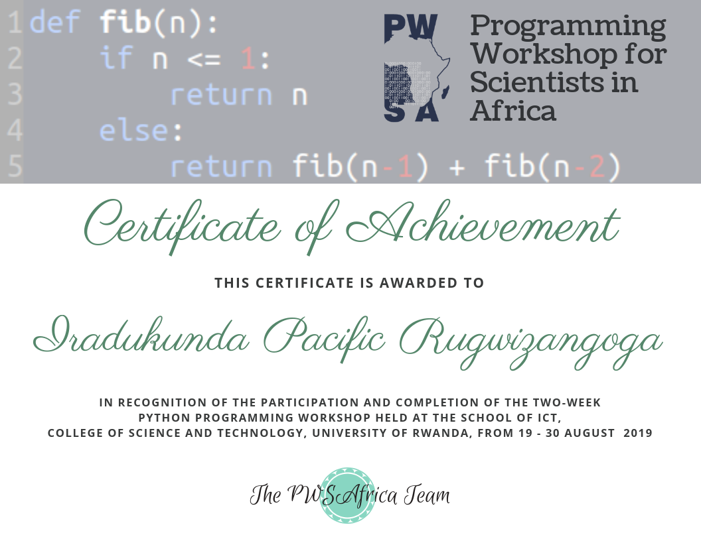

<h1 align="center">Hi there, I'm Pacific!  

</h1>

<!-- Social icons section -->

 
&#8287;&#8287;&#8287;

&#8287;&#8287;&#8287;
 
&#8287;&#8287;&#8287;

- 📠I'm a Computer Engineer, I hold a Computer Engineering Degree from University of Rwanda college of science and technology.  
-  👩‍💻 I’m currently taking a **Full-Stack Software Development** training at 
[Microverse](https://www.microverse.org/), a remote and diverse software development school  
- 💻 All **my projects** are available [here.](https://github.com/rugwizangoga?tab=repositories).  

### Certificates & Licenses 🥇
 

   &nbsp; &nbsp; &nbsp; &nbsp;  
    &nbsp; &nbsp; &nbsp; &nbsp;  
   &nbsp; &nbsp; &nbsp; &nbsp; 

 
   
  

&nbsp;
 
| Activities  |   Languages  |
| ----------- | ------------ |
|  | |

&nbsp;

  

 <em>Meeting people really delights me so if you want to say hello, I'll be happy to meet you! 😊 </em>

## Languages 

## Frameworks

## Testing

## Version Control & CI/CD

<h3> Visitors count </h3>
 

## Feedback

- 📫 If you have any feedback, please reach out to me at pacific.r.iradukunda@gmail.com